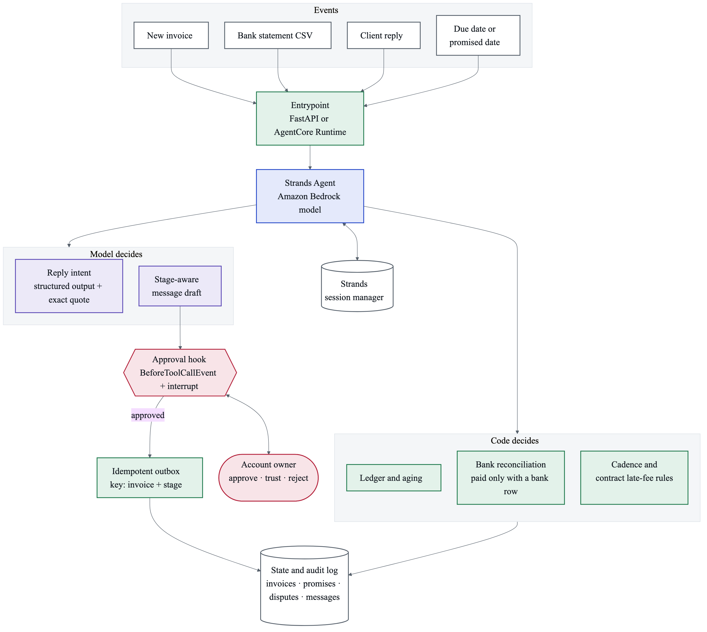

# PaidUp

**A collections agent for freelancers, built with [Strands Agents](https://strandsagents.com/).**
PaidUp chases late invoices, understands what clients reply, and only marks an invoice paid when the money shows up in the bank.

> Built for the [Agents for Humans Hackathon](https://agentsforhumans.devpost.com/) (Professional Agents track).
> All data in this repository is synthetic.



## The problem

Freelancers and small businesses do the work, send the invoice, and then become part-time debt collectors. Replies like *"I'll pay Friday"* or *"we already paid"* get buried in email, and nobody checks whether the money actually arrived.

- New York City requires clients to pay freelancers within 30 days. Since 2017 the city has received nearly 4,300 complaints and recovered more than $3.47M under that law ([NYC DCWP](https://www.nyc.gov/site/dca/news/017-25/dcwp-settlement-buzzfeed-late-payments-freelancers)).
- In a 2025 QuickBooks survey, 56% of US small businesses were owed money from unpaid invoices, $17.5K on average ([QuickBooks](https://quickbooks.intuit.com/r/small-business-data/small-business-late-payments-report-2025/)).

Accounting tools already send reminders on a fixed schedule. They don't read the client's answer, pause on a dispute, or check a promise against the bank.

## What PaidUp does

| Client says | PaidUp does |
|---|---|
| *"I'll pay Friday"* | Records the promise, pauses reminders, checks the bank after that date |
| *"We already paid"* | Marks the invoice **reported, not confirmed** until a matching bank row exists |
| *"We never received the files"* | Opens a dispute and stops chasing that invoice |
| A payment arrives under another name | Proposes which invoice it belongs to and asks the owner to confirm |
| Nothing | Proposes the next reminder stage allowed today: friendly, firm, or formal |

**The owner stays in control.** The agent pauses and asks before:

- any formal notice or late fee;
- confirming a payment;
- any reminder at a stage the owner has not chosen to trust.

**The core rule:** a promise is not a payment, and a sent message is not money collected.

PaidUp never moves money, never threatens, never contacts third parties, and never reports anyone to a credit bureau.

## How it works

The model handles language. Code handles money and time.

| Concern | Owner | Where |
|---|---|---|
| Balances, partial payments, overpayments, bank reconciliation | Code | `ledger.py` |
| Reminder stages, pauses, minimum gap between messages, late fees | Code | `cadence.py` |
| No duplicate messages (`UNIQUE(invoice, stage)`), audit log | SQLite | `store.py` |
| Understanding a client reply | Model, via structured output | `intent.py`, `paidup_agent.py` |
| Checking that the quoted sentence really is in the email | Code | `intent.py` (`verify`) |
| Drafting client messages | Model | `paidup_agent.py` |
| Approving sensitive actions | Owner, via interrupts | `ApprovalHook` in `paidup_agent.py` |

### Strands Agents features used

- **Tools** (`@tool(context=True)`) wrap the deterministic core. The simulated date reaches tools through `invocation_state`, never from the model.
- **Structured output** (`structured_output_model=ReplyIntent`) classifies replies into `promise_to_pay`, `claims_paid`, `dispute`, `partial_offer`, `needs_info`, `out_of_office` or `unclear`, with the exact supporting quote. If the quote isn't in the email, or a promise has no date, the label is downgraded to `unclear`.
- **Hooks + interrupts**: a `BeforeToolCallEvent` hook raises an interrupt before sensitive tools. The owner answers `approve`, `trust` (friendly or firm reminders only; stored in `agent.state`) or `reject`, and the agent resumes from the same point.
- **Session management** (`FileSessionManager`) keeps the conversation and state across invocations, because collections span weeks.
- **`SequentialToolExecutor`** runs one tool at a time, so approvals are asked in order and the SQLite store is never accessed concurrently.
- **Amazon Bedrock** model: `us.anthropic.claude-sonnet-4-6` in `us-east-1`.

## Run it

### Requirements

- Python 3.12+ (developed on 3.14)
- AWS credentials with Amazon Bedrock access to Claude Sonnet 4.6 in `us-east-1`. A least-privilege IAM policy only needs `bedrock:InvokeModel` and `bedrock:InvokeModelWithResponseStream` on foundation models and inference profiles.

### Setup

```bash
python3 -m venv .venv
.venv/bin/pip install -r requirements.txt
```

Optional: `export PAIDUP_OWNER_NAME="Your Name"` (defaults to the fictional "Alex Morgan").

### Web demo

```bash
.venv/bin/uvicorn app:app --port 8000
```

Open http://127.0.0.1:8000 and follow the story:

1. **Run daily review.** Approve, trust or reject each proposed reminder.
2. **Deliver** the client emails one by one: a promise, a payment claim, a dispute, and an unclear reply.
3. **Load April statement.** Confirm the partial payment that arrived under a parent company's name.

### Terminal demo

```bash
.venv/bin/python demo.py                 # asks approve / trust / reject in the terminal
.venv/bin/python demo.py --auto-approve  # non-interactive
```

### Tests

```bash
.venv/bin/python -m pytest -q
```

The tests cover the ledger, cadence, store, intent verification, approval rules, tools, and API. They never call Bedrock.

## Project structure

```
ledger.py        bank reconciliation and invoice status
cadence.py       which reminder is allowed today, and why not otherwise
store.py         SQLite state, idempotent outbox, audit log, CSV loaders
intent.py        ReplyIntent schema and deterministic quote verification
paidup_agent.py  Strands agent: tools, approval hook, system prompt
app.py           FastAPI API for the web demo
static/          single-page demo UI
demo.py          terminal demo
demo_data/       synthetic invoices, bank statements and client emails
docs/            architecture diagram (Mermaid source and PNG)
tests/           pytest suite
```

## Limitations

- Single-user demo: one in-memory session, so two browser tabs share state.
- Email and bank feeds are simulated with files. There is no real mailbox or bank connection.
- A single bank payment that references two invoices is applied to the first one.
- Collection and communication rules vary by country. This MVP targets business-to-business invoices owed directly to the freelancer.

## What's next

- Use QuickBooks or Xero as the invoice source.
- Send from the owner's mailbox with OAuth.
- Read transactions through a consented bank aggregator.
- Deploy on Amazon Bedrock AgentCore Runtime.
- Per-country cadence rules.

## License

[MIT](LICENSE)
