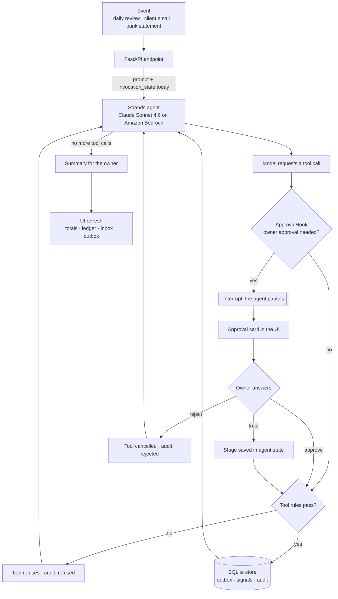
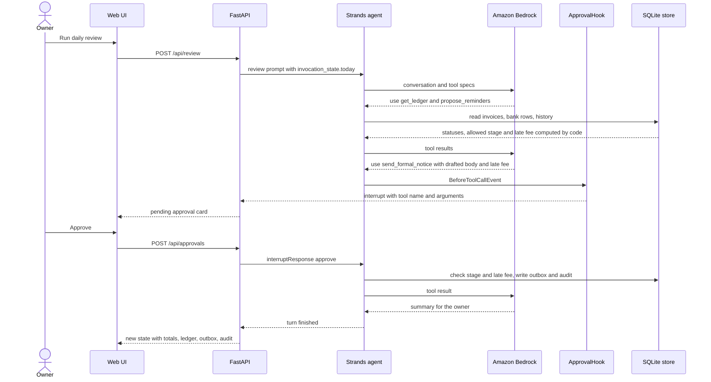
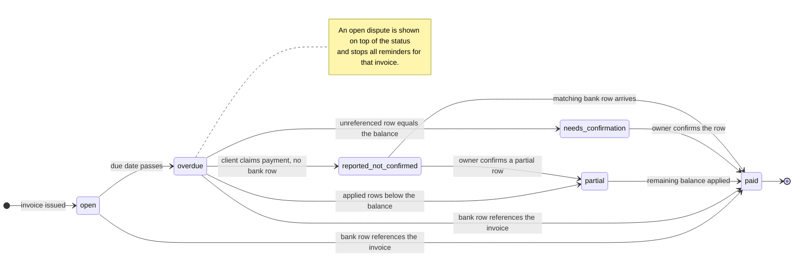
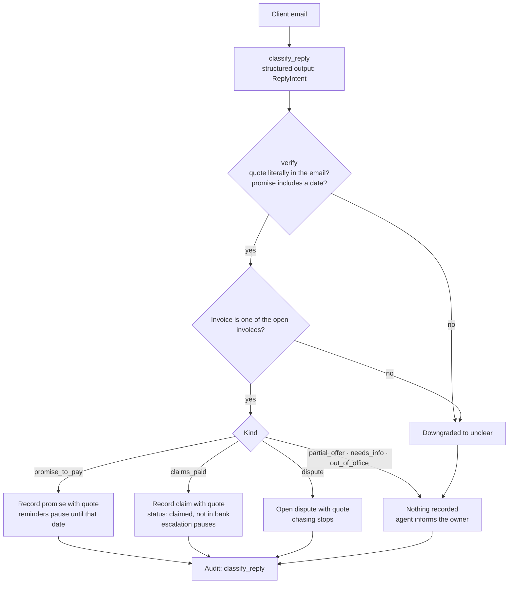
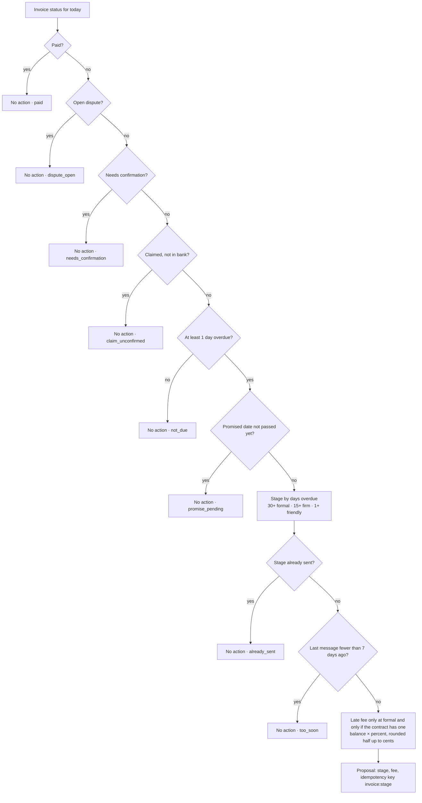
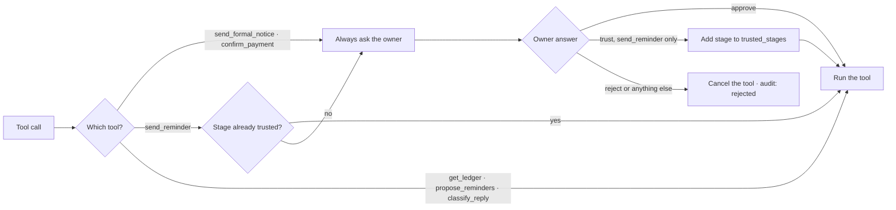
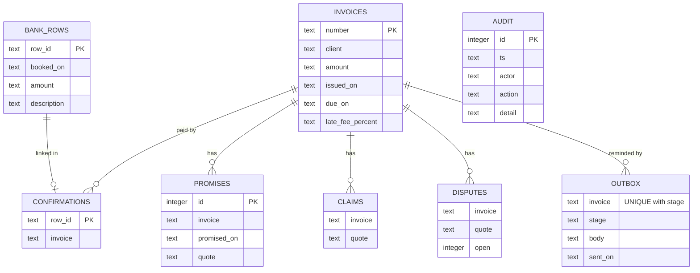

# PaidUp diagrams

Every diagram below mirrors the code: `ledger.py`, `cadence.py`, `intent.py`, `paidup_agent.py`, `store.py` and `app.py`.
Code decides money, dates and stages. The model reads replies and writes messages. The owner approves anything sensitive.

- [1. How an agent turn works](#1-how-an-agent-turn-works)
- [2. Approval round trip](#2-approval-round-trip)
- [3. Invoice status](#3-invoice-status)
- [4. Understanding a client reply](#4-understanding-a-client-reply)
- [5. Which reminder is allowed today](#5-which-reminder-is-allowed-today)
- [6. When the owner is asked](#6-when-the-owner-is-asked)
- [7. Data model](#7-data-model)

The system architecture is in [architecture.mmd](architecture.mmd) ([PNG](architecture.png)).

---

## 1. How an agent turn works

Every event — the daily review, a client email, or a new bank statement — runs one Strands agent turn. The turn pauses whenever the owner has to decide.

## 2. Approval round trip

A formal notice from the daily review: the model drafts it, code decides that it is allowed and what the fee is, and the owner approves it.

## 3. Invoice status

`ledger.reconcile` computes each status from invoices, bank rows, owner confirmations and client claims. Only applied bank rows move money. A claim or a candidate row never does.

Priority when several conditions apply: `paid` > `partial` > `needs_confirmation` > `reported_not_confirmed` > `overdue` > `open`.

## 4. Understanding a client reply

The model classifies the email with structured output. Deterministic checks decide whether that label can be trusted, and only three kinds change state.

## 5. Which reminder is allowed today

`cadence.next_action` runs for every unpaid invoice. The checks go in this order, and the first match wins.

The send tools apply the same rules. `send_reminder` refuses any stage other than the one allowed today, and `send_formal_notice` refuses a late fee different from the computed one.

## 6. When the owner is asked

`approval_needed` plus the answer handling in `ApprovalHook`.

## 7. Data model

SQLite tables in `store.py`. Money is stored as decimal strings, never floats. `UNIQUE(invoice, stage)` in the outbox makes a duplicate reminder impossible.

